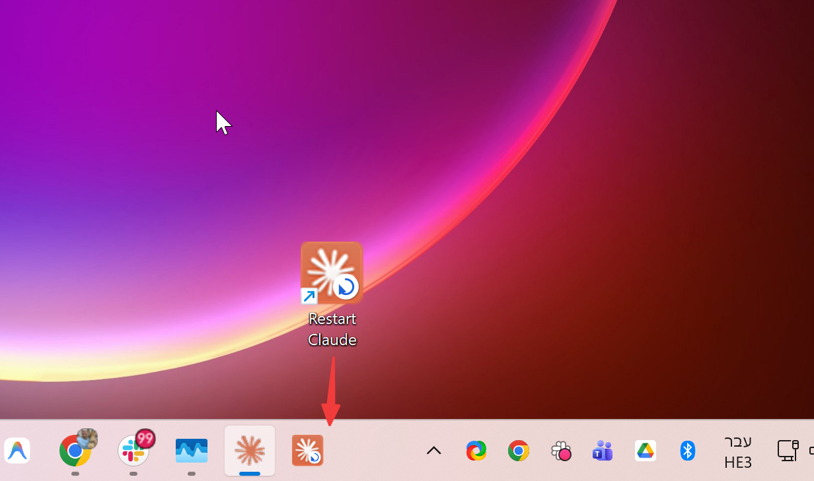

# Claude Desktop Restart

A one-click shortcut to instantly close and relaunch **Claude for Desktop** on Windows.

<p align="center">
  
</p>

---

## Why this exists

Claude for Desktop has no built-in "Restart" button — only **Quit**. Every time you install a new **skill** or **plugin**, you have to:

1. Quit Claude manually
2. Find the Claude app
3. Click to launch it again

That's a few too many steps when you're in a flow. This shortcut collapses all of that into **a single click** — it closes the current Claude instance and immediately starts a fresh one.

---

## What you get

A desktop shortcut with a custom icon — the Claude logo with a blue circular refresh arrow badge in the corner, so it's easy to tell apart from the regular Claude icon.

<p align="left">
  
</p>

---

## Requirements

- Windows 10 or Windows 11
- [Claude for Desktop](https://claude.ai/download) installed from the **Microsoft Store** (or directly from Anthropic's website using the `.exe` installer — both work)

---

## How to install — step by step

### Step 1 — Download the files

1. On this page, click the green **`< > Code`** button near the top right
2. Click **"Download ZIP"**
3. A file called `claude-desktop-restart-main.zip` will download to your Downloads folder

### Step 2 — Unzip the folder

1. Go to your **Downloads** folder
2. Right-click the ZIP file → **"Extract All..."**
3. Click **"Extract"** — a new folder called `claude-desktop-restart-main` will appear

### Step 3 — Run the installer

1. Open the `claude-desktop-restart-main` folder
2. Right-click the file named **`setup.ps1`**
3. Click **"Run with PowerShell"**

> **If Windows shows a blue security warning** ("Windows protected your PC"):
> - Click **"More info"**
> - Then click **"Run anyway"**
>
> This warning appears because the script wasn't downloaded from the Microsoft Store. The script only interacts with Claude — you can read every line of it yourself.

4. A black window will flash briefly, then disappear — that's normal
5. You should now see a **"Restart Claude"** shortcut on your Desktop ✓

---

## How to use it

Simply **double-click** the "Restart Claude" shortcut on your Desktop whenever you want to restart Claude.

That's it. Claude will close and reopen automatically within about a second.

---

## How to pin it to your taskbar (optional)

If you want one-click access from the taskbar at the bottom of your screen:

1. Right-click the **"Restart Claude"** shortcut on your Desktop
2. Click **"Show more options"**
3. Click **"Pin to taskbar"**

The icon will appear at the bottom of your screen alongside your other pinned apps.

---

## Troubleshooting

**"The shortcut appeared but nothing happens when I click it"**
Make sure Claude for Desktop is actually running before you click the shortcut. If Claude isn't open, the shortcut will still work — it just won't have anything to close first, so Claude will simply open fresh.

**"I see a PowerShell error about execution policy"**
Open the **Start menu**, search for **"PowerShell"**, right-click it and choose **"Run as administrator"**, then paste this and press Enter:
```
Set-ExecutionPolicy -Scope CurrentUser -ExecutionPolicy RemoteSigned
```
Then try running `setup.ps1` again.

**"Claude opened but my skills/plugins still aren't showing"**
Wait a few seconds after Claude opens — it needs a moment to load everything on startup.

---

## How it works (for the curious)

`restart-claude.ps1` uses PowerShell to:
1. Find the Claude app using Windows' built-in app registry (`Get-AppxPackage`) — no hardcoded paths, so it works on any machine
2. Stop all Claude for Desktop processes (it leaves Claude Code / terminal sessions untouched)
3. Wait 800ms for a clean shutdown
4. Relaunch Claude via the Windows shell (`explorer.exe shell:AppsFolder\...`)

---

## License

MIT — do whatever you want with it.
